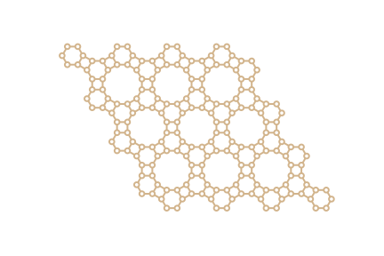

# Zeo2D

Plot 3D zeolites as 2D illustrations.

## Introduction

Plot 2D zeolite illustration can be easy, see [Demo](./demo.ipynb)

## Requirements
* Python 3.6 or later
* [NumPy](https://numpy.org/)
* [Matplotlib](https://matplotlib.org/)
* [ASE](https://wiki.fysik.dtu.dk/ase/)

## Acknowledgement

All structures used for demo were from [IZA](http://www.iza-structure.org/IZA-SC/ftc_table.php)